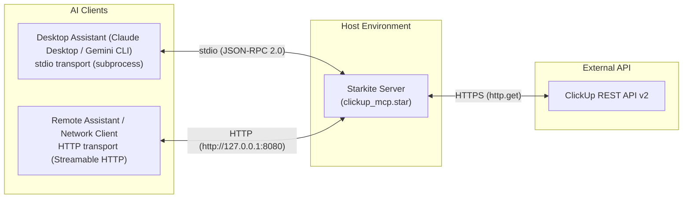

# Building an MCP Server in Under 80 Lines of Starlark with Starkite

*Turn any REST API into an AI Agent tool server over stdio or HTTP with zero npm packages, zero Python virtual environments, and zero JSON Schema boilerplate.*

---

The **Model Context Protocol (MCP)** provides an open standard connecting AI assistants—such as Claude Desktop, Gemini CLI, Cursor, and Claude Code—to external databases, developer platforms, and internal services.

Building an MCP server using traditional runtimes typically introduces significant project overhead:

- **The TypeScript path**: `npm init`, `package.json`, `tsconfig.json`, `npm install`, ESM vs. CommonJS configuration, and a large `node_modules` directory before writing a single tool.
- **The Python path**: Virtual environment management, `pip` dependencies, Pydantic type models, and Dockerfiles to ensure reproducibility across machines.

**Starkite** (`kite`) offers a lighter, self-contained alternative. It is a single, statically linked binary embedding **Starlark**—the deterministic Python dialect originally developed for Bazel—alongside built-in modules for HTTP, OS primitives, command-line arguments, sandboxing, and MCP serving.

In this tutorial, we build a ClickUp MCP server in **under 80 lines of Starlark**. It supports both standard MCP transports:
- **stdio mode**: Launched directly by AI assistants as a child process.
- **HTTP mode**: Run as a standalone daemon exposing a Streamable HTTP endpoint for remote agents, network clients, or multi-client environments.

---

## What We're Building

We will create a ClickUp MCP server exposing two core tools:

1. `get_authorized_user()`: Inspects the authenticated user profile and discovers primary workspace `team_id` and `user_id`.
2. `get_tasks(team_id, assignee_id, status)`: Queries open tasks for a workspace with clean filtering.

Here is the high-level architecture across both transport modes:



When operating in **stdio mode**, the AI client manages the process lifecycle by launching `kite run ./clickup_mcp.star` as a child process and communicating over standard input/output.

When operating in **HTTP mode**, the script runs as a persistent service listening on a local or remote port (e.g. `http://127.0.0.1:8080/`), allowing one or more AI clients to connect over Streamable HTTP.

---

## Step 1: Handling CLI Options and Authentication

Starkite provides declarative argument parsing through the built-in `args` module. We define flags for the ClickUp API token and an optional HTTP listen port:

```python
BASE_URL = "https://api.clickup.com/api/v2"

args.string("api-key", shorthand = "k", default = "", help = "ClickUp Personal API Token (pk_...)")
args.int("port", shorthand = "p", default = 0, help = "HTTP port to listen on (0 for stdio transport)")
```

In `main()`, we parse the options, validate the token, and configure global HTTP authentication:

```python
def main():
    opts = args.parse()
    if not opts.api_key:
        fail("ClickUp API token required: pass --api-key <token>")

    # Configure global HTTP authentication for all requests
    http.config(headers={"Authorization": opts.api_key})
```

With `http.config(headers={"Authorization": opts.api_key})`, every subsequent `http.get()` call automatically includes the ClickUp authentication token.

---

## Step 2: Discovering User and Workspace Identity

ClickUp organizes tasks under workspaces (referred to as `teams` in the API). Instead of maintaining static configuration files or manual ID mappings, our first tool lets the AI model discover account identity and the primary workspace ID directly:

```python
def get_authorized_user():
    """Get authenticated user identity and primary workspace team ID."""
    user = json.decode(http.get(BASE_URL + "/user").body).get("user", {})
    teams = json.decode(http.get(BASE_URL + "/team").body).get("teams", [])
    team = teams[0] if teams else {}

    return {
        "user_id": "%d" % user.get("id"),
        "username": user.get("username", ""),
        "email": user.get("email", ""),
        "team_id": team.get("id", ""),
        "team_name": team.get("name", ""),
    }
```

> [!TIP]
> **Concise JSON Parsing with `.body`**: In Starkite, `json.decode()` natively accepts either a `string` or raw `bytes`. Reading `resp.body` passes the payload bytes directly into the JSON decoder without requiring an extra `.get_text()` call.

When invoked by an AI client, this tool returns:
```json
{
  "user_id": "12345678",
  "username": "Jane Developer",
  "email": "jane@example.com",
  "team_id": "98765432",
  "team_name": "Acme Engineering"
}
```

The AI model now has both `team_id` and `user_id` ready to supply to task queries.

---

## Step 3: Defining Tools with Automatic Schema Inference

In Starkite, you do not need to write manual JSON Schema definitions. `mcp.serve()` automatically inspects the function signature, default parameter arguments, and docstring to generate the Model Context Protocol tool schema:

```python
def get_tasks(team_id, assignee_id="", status=""):
    """List open tasks for a team workspace.

    Args:
        team_id: ClickUp workspace/team ID.
        assignee_id: Optional user ID to filter assigned tasks.
        status: Optional status name to filter by (e.g. 'in progress').
    """
    query = "?subtasks=false&include_closed=false"
    if assignee_id:
        query += "&assignees[]=" + assignee_id
    if status:
        query += "&statuses[]=" + status

    resp = http.get(BASE_URL + "/team/" + team_id + "/task" + query)
    if resp.status_code != 200:
        fail("ClickUp error: " + resp.get_text())

    raw_tasks = json.decode(resp.body).get("tasks", [])
    tasks = []
    for t in raw_tasks:
        priority = (t.get("priority") or {}).get("priority", "none")
        tasks.append({
            "id": t.get("id"),
            "name": t.get("name"),
            "status": (t.get("status") or {}).get("status", ""),
            "priority": priority,
            "url": t.get("url", ""),
        })
    return {"count": len(tasks), "tasks": tasks}
```

> [!NOTE]
> **Context Window Optimization**: A raw ClickUp task response contains over 50 fields, including internal IDs, custom fields, and watcher arrays. Returning raw payloads bloats your LLM's context window. Pruning the response down to essential fields (`id`, `name`, `status`, `priority`, `url`) keeps responses concise and conserves tokens.

### How Starkite Infers the Tool Definition

When passed to `mcp.serve(tools=[get_tasks])`, Starkite inspects `get_tasks` and generates the corresponding MCP tool descriptor:
- **Tool Description**: Extracted from the first line of the docstring (`"List open tasks for a team workspace."`).
- **`team_id`**: Inferred as a required string parameter because it has no default argument.
- **`assignee_id`**: Inferred as an optional string parameter (defaults to `""`).
- **`status`**: Inferred as an optional string parameter (defaults to `""`).
- **Parameter Descriptions**: Parsed directly from the Google-style `Args:` docstring section.

When an AI model requests available tools via `tools/list`, Starkite publishes:
```json
{
  "name": "get_tasks",
  "description": "List open tasks for a team workspace.",
  "inputSchema": {
    "type": "object",
    "properties": {
      "team_id": {
        "type": "string",
        "description": "ClickUp workspace/team ID."
      },
      "assignee_id": {
        "type": "string",
        "description": "Optional user ID to filter assigned tasks."
      },
      "status": {
        "type": "string",
        "description": "Optional status name to filter by (e.g. 'in progress')."
      }
    },
    "required": ["team_id"]
  }
}
```

---

## Step 4: Serving Over MCP (stdio or HTTP)

At the end of `main()`, we invoke `mcp.serve()`. Depending on whether `--port` was specified on the command line, the server starts in stdio mode or starts a Streamable HTTP listener:

```python
    if opts.port > 0:
        mcp.serve(
            name="clickup-mini",
            version="0.1.0",
            tools=[get_authorized_user, get_tasks],
            port=opts.port,
        )
    else:
        mcp.serve(
            name="clickup-mini",
            version="0.1.0",
            tools=[get_authorized_user, get_tasks],
        )
```

### Transport Comparison

| Feature | `stdio` Mode (`port=0` / omitted) | `http` Mode (`port > 0`) |
| :--- | :--- | :--- |
| **How it runs** | Child process launched by AI client | Long-running standalone service/daemon |
| **Communication** | JSON-RPC 2.0 over standard I/O | Streamable HTTP (POST / SSE) over TCP |
| **Typical client** | Claude Desktop, Gemini CLI, Cursor | Remote agents, team servers, HTTP MCP clients |
| **Concurrency** | Single client per process | Multiple concurrent clients/sessions |
| **Bind options** | N/A | Supports `host`, `path`, `tls_cert`, `tls_key` |

- **stdio mode**: `mcp.serve()` connects to standard input and output. It handles capability negotiation (`initialize`), publishes tool definitions (`tools/list`), and executes invocations (`tools/call`). When an API call fails, `fail("...")` returns a standard MCP `{ "isError": true }` response to the model while keeping the session active.
- **HTTP mode**: `mcp.serve()` binds an HTTP server on the configured port. On startup, it logs `mcp.serve: listening on http://127.0.0.1:<port>/` to stderr and remains active until interrupted (SIGINT/SIGTERM).

### Securing the Server with TLS (HTTPS)

If you plan to expose the MCP server across an internal network, a Kubernetes cluster, or to remote agents, `mcp.serve()` can natively terminate TLS connections without requiring an external reverse proxy (such as NGINX or Envoy).

To enable TLS, pass `tls_cert` and `tls_key` alongside `port`:

```python
mcp.serve(
    name     = "clickup-mini",
    version  = "0.1.0",
    tools    = [get_authorized_user, get_tasks],
    port     = 8443,
    host     = "0.0.0.0",                 # default: "127.0.0.1"
    path     = "/mcp",                    # default: "/"
    tls_cert = "/path/to/server.crt",     # path to PEM certificate
    tls_key  = "/path/to/server.key",     # path to PEM private key
)
```

Key considerations when enabling TLS:
- **Pair Requirement**: `tls_cert` and `tls_key` must both be provided; passing only one causes a validation error at startup.
- **Port Requirement**: TLS options require `port` to be set to a positive integer (stdio mode ignores them).
- **Startup Notification**: When TLS is active, Starkite automatically logs `mcp.serve: listening on https://<host>:<port><path>` to stderr.
- **Client Connections**: MCP clients connect using `https://` URLs (e.g. `https://127.0.0.1:8443/mcp`). Starkite's client module also connects natively via `mcp.connect("https://127.0.0.1:8443/mcp")`.

---

## The Complete Script (`clickup_mcp.star`)

Here is the complete script ([clickup_mcp.star](clickup_mcp.star)):

```python
#!/usr/bin/env kite
# clickup_mcp.star — Minimal ClickUp MCP Server built with Starkite.
#
# Exposes 2 essential ClickUp tools over Model Context Protocol (MCP):
#   1. get_authorized_user()           -> User identity and primary workspace team ID
#   2. get_tasks(team_id, assignee_id) -> Query open tasks for a workspace
#
# Run in stdio mode:
#   kite run --allow-local --sandbox-net ./clickup_mcp.star --api-key pk_your_token
#
# Run in HTTP mode:
#   kite run --allow-local --sandbox-net ./clickup_mcp.star --api-key pk_your_token --port 8080

BASE_URL = "https://api.clickup.com/api/v2"

args.string("api-key", shorthand = "k", default = "", help = "ClickUp Personal API Token (pk_...)")
args.int("port", shorthand = "p", default = 0, help = "HTTP port to listen on (0 for stdio transport)")

def get_authorized_user():
    """Get authenticated user identity and primary workspace team ID."""
    user = json.decode(http.get(BASE_URL + "/user").body).get("user", {})
    teams = json.decode(http.get(BASE_URL + "/team").body).get("teams", [])
    team = teams[0] if teams else {}

    return {
        "user_id": "%d" % user.get("id"),
        "username": user.get("username", ""),
        "email": user.get("email", ""),
        "team_id": team.get("id", ""),
        "team_name": team.get("name", ""),
    }

def get_tasks(team_id, assignee_id="", status=""):
    """List open tasks for a team workspace.

    Args:
        team_id: ClickUp workspace/team ID.
        assignee_id: Optional user ID to filter assigned tasks.
        status: Optional status name to filter by (e.g. 'in progress').
    """
    query = "?subtasks=false&include_closed=false"
    if assignee_id:
        query += "&assignees[]=" + assignee_id
    if status:
        query += "&statuses[]=" + status

    resp = http.get(BASE_URL + "/team/" + team_id + "/task" + query)
    if resp.status_code != 200:
        fail("ClickUp error: " + resp.get_text())

    raw_tasks = json.decode(resp.body).get("tasks", [])
    tasks = []
    for t in raw_tasks:
        priority = (t.get("priority") or {}).get("priority", "none")
        tasks.append({
            "id": t.get("id"),
            "name": t.get("name"),
            "status": (t.get("status") or {}).get("status", ""),
            "priority": priority,
            "url": t.get("url", ""),
        })
    return {"count": len(tasks), "tasks": tasks}

def main():
    opts = args.parse()
    if not opts.api_key:
        fail("ClickUp API token required: pass --api-key <token>")

    http.config(headers={"Authorization": opts.api_key})

    if opts.port > 0:
        mcp.serve(
            name="clickup-mini",
            version="0.1.0",
            tools=[get_authorized_user, get_tasks],
            port=opts.port,
        )
    else:
        mcp.serve(
            name="clickup-mini",
            version="0.1.0",
            tools=[get_authorized_user, get_tasks],
        )
```

---

## Running the Server and Connecting Clients

### Option 1: Running in stdio Mode (Subprocess)

In stdio mode, the MCP client spawns the `kite` binary directly as a subprocess.

First, verify that the script displays help options as expected:

```bash
kite run ./clickup_mcp.star --help
```

Output:
```text
Usage: kite run ./clickup_mcp.star [flags]

Flags:
  -k, --api-key string        ClickUp Personal API Token (pk_...) (default: "")
  -p, --port int              HTTP port to listen on (0 for stdio transport) (default: 0)
  -h, --help                  Show help for clickup_mcp.star
```

#### Configuring AI Clients for stdio

Add the server to your client's MCP configuration file (e.g., `~/.gemini/config/mcp_config.json`, `claude_desktop_config.json`, or Cursor Settings):

```json
{
  "mcpServers": {
    "clickup": {
      "command": "kite",
      "args": [
        "run",
        "--allow-local",
        "--sandbox-net",
        "/absolute/path/to/clickup_mcp.star",
        "--api-key",
        "pk_your_clickup_api_token"
      ]
    }
  }
}
```

> [!NOTE]
> **Sandboxing & Permissions**: The `--allow-local` flag authorizes MCP server hosting and network capabilities, while `--sandbox-net` enforces kernel-level filesystem isolation (Seatbelt on macOS, Landlock on Linux). The script can make outbound HTTPS calls to the ClickUp API, but cannot access unauthorized filesystem locations.

---

### Option 2: Running in HTTP Mode (Streamable HTTP Server)

In HTTP mode, the server runs independently as a standalone network service.

#### 1. Start the HTTP Server

Run the script and supply the `--port` argument:

```bash
kite run --allow-local --sandbox-net ./clickup_mcp.star \
  --api-key pk_your_clickup_api_token \
  --port 8080
```

Starkite initializes the HTTP listener and logs to stderr:

```text
mcp.serve: listening on http://127.0.0.1:8080/
```

The server remains running, waiting for incoming client connections.

#### 2. Configure AI Clients for HTTP

For MCP clients that support HTTP/SSE connections, register the endpoint URL in your configuration:

```json
{
  "mcpServers": {
    "clickup": {
      "url": "http://127.0.0.1:8080/"
    }
  }
}
```

#### 3. Connect from Another Starkite Script

You can also connect to and test the running HTTP MCP server directly using Starkite's built-in `mcp.connect()` client:

```python
# test_client.star
client = mcp.connect("http://127.0.0.1:8080/")

# List discovered tools
print("Discovered tools:")
for t in client.tools:
    print("  - %s: %s" % (t.name, t.description))

# Invoke a tool
res = client.call("get_authorized_user")
print("\nResponse:")
print(res.text)

client.close()
```

Run the client in a separate terminal:

```bash
kite run --allow-local ./test_client.star
```

Output:
```text
Discovered tools:
  - get_authorized_user: Get authenticated user identity and primary workspace team ID.
  - get_tasks: List open tasks for a team workspace.

Response:
{"email":"jane@example.com","team_id":"98765432","team_name":"Acme Engineering","user_id":"12345678","username":"Jane Developer"}
```

#### 4. Verify with `curl`

To verify the HTTP endpoint using `curl`, send a standard JSON-RPC 2.0 `initialize` request:

```bash
curl -X POST http://127.0.0.1:8080/ \
  -H "Content-Type: application/json" \
  -d '{
    "jsonrpc": "2.0",
    "id": 1,
    "method": "initialize",
    "params": {
      "protocolVersion": "2024-11-05",
      "capabilities": {},
      "clientInfo": {"name": "curl-test", "version": "1.0.0"}
    }
  }'
```

---

### Option 3: Running over HTTPS (TLS)

When exposing the server across a network, pass `tls_cert` and `tls_key` to `mcp.serve()` to enable encrypted HTTPS communication.

#### 1. Start the TLS Server

```bash
kite run --allow-local --sandbox-net ./clickup_mcp.star \
  --api-key pk_your_clickup_api_token \
  --port 8443
```

Starkite initializes the TLS listener and logs to stderr:

```text
mcp.serve: listening on https://127.0.0.1:8443/
```

#### 2. Configure AI Clients for HTTPS

Register the secure URL in your MCP client configuration:

```json
{
  "mcpServers": {
    "clickup": {
      "url": "https://127.0.0.1:8443/"
    }
  }
}
```

#### 3. Connect from Starkite or Verify with `curl`

Connect directly using Starkite's `mcp.connect()`:

```python
client = mcp.connect("https://127.0.0.1:8443/")
print("Tools:", [t.name for t in client.tools])
client.close()
```

Or verify with `curl` (using `-k` if testing with self-signed certificates):

```bash
curl -k -X POST https://127.0.0.1:8443/ \
  -H "Content-Type: application/json" \
  -d '{
    "jsonrpc": "2.0",
    "id": 1,
    "method": "initialize",
    "params": {
      "protocolVersion": "2024-11-05",
      "capabilities": {},
      "clientInfo": {"name": "curl-tls-test", "version": "1.0.0"}
    }
  }'
```

---

## Verifying in Action

Once configured in your AI assistant, submit a prompt:

> **You:** "What tasks are assigned to me in ClickUp right now?"

The assistant invokes the tools in sequence:
1. Calls `get_authorized_user()` to retrieve your `team_id` and `user_id`.
2. Calls `get_tasks(team_id="98765432", assignee_id="12345678")` to retrieve active tasks.

The model formats and presents the result:

```text
Here are your active assigned tasks:
1. Update onboarding documentation (Priority: High)
   https://app.clickup.com/t/86example1
2. Refactor logging middleware (Priority: Normal)
   https://app.clickup.com/t/86example2
3. Add unit tests for authentication service (Priority: None)
   https://app.clickup.com/t/86example3
```

---

## Key Takeaways

1. **Zero Runtime Dependencies**: No `node_modules`, package managers, or Python virtual environments. A single `kite` binary executes the server.
2. **Dual Transport Support**: Switch between stdio subprocess execution and standalone `http` streaming with a single flag.
3. **Automatic Schema Inference**: Function signatures, default parameters, and docstrings automatically map to JSON Schema definitions published over `tools/list`.
4. **Token-Efficient Payloads**: Transforming and pruning upstream REST responses before returning them to the LLM keeps prompt contexts clean and reduces token overhead.
